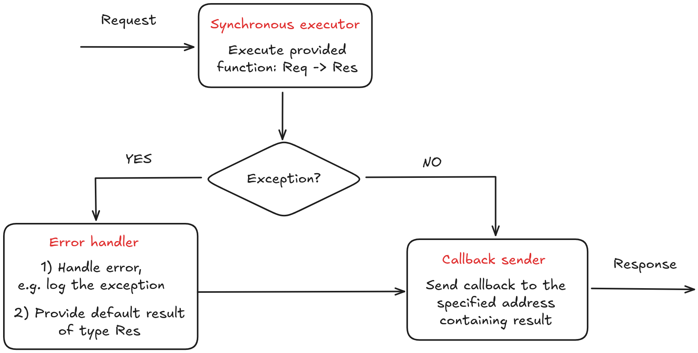
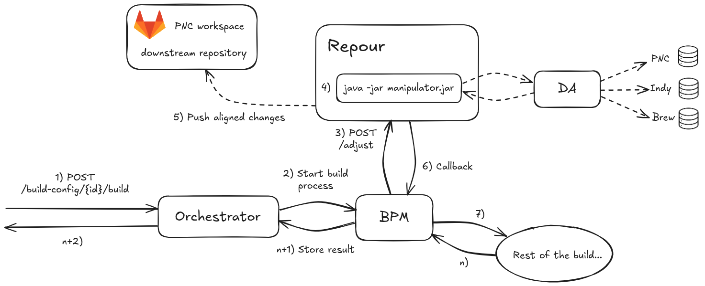
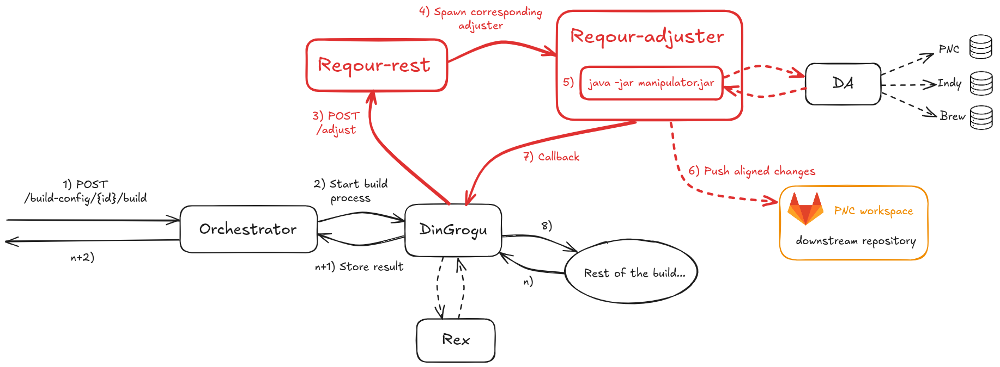
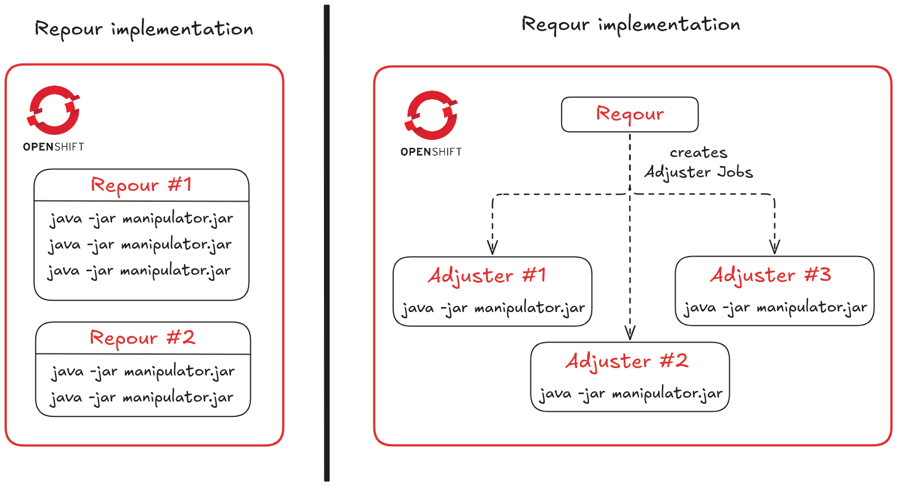

# Reqour

Reqour is nothing less and nothing more than [Repour](https://github.com/project-ncl/repour), but written in Quarkus.

## Links

### GitHub links
- https://github.com/project-ncl/reqour
  - Reqour implementation split in 3 modules (rest, adjuster, core), see [below](#source-code) for further details about the modules themselves
- https://github.com/project-ncl/pnc-api/tree/master/src/main/java/org/jboss/pnc/api/reqour/rest
  - Reqour REST API
- https://github.com/project-ncl/pnc-api/tree/master/src/main/java/org/jboss/pnc/api/reqour/dto
  - Reqour DTOs
 
### OpenShift configs
- as usually for our applications, build & deployment configs are located within [pnc-mpp repository](https://gitlab.cee.redhat.com/project-ncl/pnc-mpp)

#### Build
- https://gitlab.cee.redhat.com/project-ncl/pnc-mpp/pnc-rhel-8-reqour-image
  - parent image of the reqour-adjuster
  - contains various versions of tools (e.g. Java, Gradle, etc.) required by manipulators to proceed an alignment
- https://gitlab.cee.redhat.com/project-ncl/pnc-mpp/reqour-adjuster-image
  - build config of the adjuster
- https://gitlab.cee.redhat.com/project-ncl/pnc-mpp/reqour-image
  - build config of the (reqour) REST

#### Deployment
- https://gitlab.cee.redhat.com/project-ncl/pnc-mpp/reqour-chart
  - deployment config for both (reqour) REST, and also for the adjuster job

## High-level Overview

Reqour has the same responsibilities as Repour, namely:

1) **Running an Alignment**
2) **SCM Repository Creation**

- in addition, SCM Repositories Synchronization is:
  - run **only in case repository pre-build sync** (from an upstream repository to a downstream repository) is turned on
  - run **always** within SCM Repository Creation

### Abstraction for asynchronous (long-running) tasks

Since both alignment and SCM Repository Creation are long-running asynchronous tasks, there was created an abstraction for such tasks: **Asynchronous Task Executor (ATE)**. The main advantage of it is that we are free to write code in a synchronous manner.

In case we want to use this abstraction, we create the following 3 components:
- **Synchronous Executor**
  - executor containing the core business logic for the task we want to compute
  - written fully in synchronous way
- **Error Handler**
  - used in the Synchronous Executor throws an exception
- **Callback Sender**
  - sends a callback once asynchronous execution of the performed task is finished (either successfully or failed)

Once we write all of these 3 components, we just inject them into ATE, which will eventually execute everything asynchronously (using Quarkus's [ManagedExecutor](https://javadoc.io/static/org.eclipse.microprofile.context-propagation/microprofile-context-propagation-api/1.3/org/eclipse/microprofile/context/ManagedExecutor.html)).

#### Visual representation of ATE



#### Source code of ATE

ATE is the [following interface](https://github.com/project-ncl/reqour/blob/6f8bea6e485546f894da60ebd2358bf1b8f725f4/core/src/main/java/org/jboss/pnc/reqour/common/executor/task/TaskExecutor.java):

```java
public interface TaskExecutor {

    /**
     * Execute the task asynchronously.
     *
     * @param callbackRequest request identifying where to send the callback
     * @param request input request of the synchronous executor
     * @param syncExecutor executor, which runs the operation synchronously
     * @param errorHandler handle the error, and create the default result
     * @param callbackSender callback sender
     * @param <T> request type
     * @param <R> result type
     */
    <T, R> void executeAsync(
            Request callbackRequest,
            T request,
            Function<T, R> syncExecutor,
            BiFunction<T, Throwable, R> errorHandler,
            BiConsumer<Request, R> callbackSender);
}
```

[ATE implementation](https://github.com/project-ncl/reqour/blob/6f8bea6e485546f894da60ebd2358bf1b8f725f4/core/src/main/java/org/jboss/pnc/reqour/common/executor/task/TaskExecutorImpl.java):
```java
@ApplicationScoped
public class TaskExecutorImpl implements TaskExecutor {

    private final ManagedExecutor executor;

    @Inject
    public TaskExecutorImpl(ManagedExecutor executor) {
        this.executor = executor;
    }

    @Override
    public <T, R> void executeAsync(
            Request callbackRequest,
            T request,
            Function<T, R> syncExecutor,
            BiFunction<T, Throwable, R> errorHandler,
            BiConsumer<Request, R> callbackSender) {
        executor.supplyAsync(() -> syncExecutor.apply(request))
                .exceptionally(t -> errorHandler.apply(request, t))
                .thenAccept(res -> callbackSender.accept(callbackRequest, res));
    }
}
```

Finally, [example usage](https://github.com/project-ncl/reqour/blob/6f8bea6/rest/src/main/java/org/jboss/pnc/reqour/rest/endpoints/InternalSCMRepositoryCreationEndpointImpl.java#L52-L63) of ATE:
```java
taskExecutor.executeAsync(
    creationRequest.getCallback(),
    creationRequest,
    service::createInternalSCMRepository,
    this::handleError,
    callbackSender::sendInternalSCMRepositoryCreationCallback
);
```

### SCM Repository Creation

This operation consists of invocation of two endpoints:
- **POST /internal-scm**
  - given the upstream repository, it creates new downstream repository (inside PNC workspace), into which has Reqour write permissions (used e.g. when pushing alignment changes), unlike the upstream repository, into which Reqour is not able to push
- **POST /clone**
  - synchronizes a downstream repository to its corresponding upstream counterpart

Both of the endpoints above are handled **asynchronously** (using ATE), i.e., once invoked, **202 Accepted** is returned to the caller. Hence, caller's thread is not blocked. Once the callee completes, it makes a callback into the specified location (known from initial request).

### Alignment

#### Old Workflow
In the old workflow (using BPM + Repour), the alignment process (within the whole build process) worked as follows:



Brief explanation of the workflow (from BPM point, i.e., starting from step 3 in the picture above):
- BPM requests Repour's /adjust endpoint in order to perform alignment
- Repour runs (properly configured based on the request) long-running manipulator process using its [asyncio library](https://docs.python.org/3/library/asyncio.html) by placing it onto asyncio's event loop
  - a manipulator uses [DA](https://github.com/project-ncl/dependency-analysis) behind the scenes (which uses proper DBs to choose the appropriate versions during version-increment and dependency alignment)
- Once an alignment is finished, its changes are pushed to **the downstream repository**
- Callback is sent to BPM to proceed with the build process further

#### New Workflow
In the new workflow (using DinGrogu + Reqour), the alignment process (within the whole build process) works as follows:



Brief explanation of the workflow (from DinGrogu point, i.e., starting from step 3 in the picture above):
- DinGrogu requests Reqour's **POST /adjust** endpoint in order to perform an alignment
- Corresponding endpoint handler of **reqour-rest** handles the request and has **a single task**: to create the corresponding reqour-adjuster pod
- Created reqour-adjuster starts long-running manipulator process (among others, using ATE)
  - a manipulator uses [DA](https://github.com/project-ncl/dependency-analysis) behind the scenes (which uses proper DBs to choose the appropriate versions during version-increment and dependency alignment)
- Once an alignment is finished, its changes are pushed to **the downstream repository**
- Callback is sent **directly from reqour-adjuster** to DinGrogu (which is further propagated to Rex) to proceed with the build process further

#### Comparison of the old solution (RePour) and the new solution (ReQour)

Migration of Repour to a new solution had a goal to enhance:

- **Maintainability**
  - Repour was written in Python
  - Reqour is written in Quarkus
  - the number of developers who are able to contribute to Reqour right away increased significantly

- **Clusterability**
  - Repour was stateful
    - in order to perform cancel operation, it had to store which asynchronous tasks are running at each replica
  - Reqour is stateless
    - cancelling is supported only for Alignment operation
    - reqour-rest replica does not need to store which adjuster jobs it started (in case of cancel/{id}, any replica simply checks whether the adjuster corresponding to that id exists – and if it does, it simply kills it)
  - stateless applications are naturally clusterable

- **Scalability**
  - **Old Solution Scalability**
    - there was a fixed number of replicas in our production cluster – 2
    - hence, the scaling was only vertical, handled by [Kubernetes by default](https://kubernetes.io/docs/concepts/workloads/autoscaling/#scaling-workloads-vertically)
    - practically, these 2 replicas could take up to ~10 alignments at the same (of course, this heavily depends on the size of alignments)
  - **New Solution Scalability**
    - there is a **fixed** number of **reqour-rest** replicas, but **reqour-adjuster** replicas (running alignments) are spawned **dynamically as needed**
    - hence, the scaling is mainly horizontal (a new adjuster job created for a new alignment)
    - practically, this scales up to point until there is enough space in an OpenShift cluster
    - among others, the new solution provides so-called **Backpressure Mechanism**, i.e., in case no new alignment can be run, it will wait for any of the previous alignments to finish
      - on the other hand, in the old solution, there can be OOM error (since creating of new alignments in one of 2 replicas is greedy, not controlled in any way in case the memory is about to be fully consumed)
    - for visual comparison, see the picture below:
    

### Abstraction for processes
Within Reqour, there is a need to run several processes, e.g. manipulator processes (PME/GME/..), git processes, etc.

This is handled by [own abstraction](https://github.com/project-ncl/reqour/blob/6f8bea6/core/src/main/java/org/jboss/pnc/reqour/common/executor/process/ProcessExecutor.java) – **ProcessExecutor (PE)**. As an input, it takes a [process context](https://github.com/project-ncl/reqour/blob/6f8bea6/core/src/main/java/org/jboss/pnc/reqour/model/ProcessContext.java) containing:
  - command to be executed
  - working directory – where to run the command
  - extra environment variables
  - STDOUT consumer
  - STDERR consumer

Its [implementation](https://github.com/project-ncl/reqour/blob/6f8bea6/core/src/main/java/org/jboss/pnc/reqour/common/executor/process/ProcessExecutorImpl.java) is using [completable futures](https://github.com/project-ncl/reqour/blob/6f8bea6/core/src/main/java/org/jboss/pnc/reqour/common/executor/process/ProcessExecutorImpl.java) heavily.
 
Visual representation of the PE is depicted at the picture below:


### Git Commands
Since Reqour's responsibility is to be an SCM Repository Manager, it uses git as its underlying backend.

Even though there already exist some support for git from Java, e.g. [jgit](https://github.com/eclipse-jgit/jgit), there was created an [abstraction for this](https://github.com/project-ncl/reqour/blob/6f8bea6/core/src/main/java/org/jboss/pnc/reqour/common/GitCommands.java), which uses PE in the background.

Concrete git commands are generated in [GitUtils class](https://github.com/project-ncl/reqour/blob/6f8bea6/core/src/main/java/org/jboss/pnc/reqour/common/utils/GitUtils.java), e.g.:
```java
public static List<String> clone(String url) {
    return List.of("git", "clone", "--", url, ".");
}
```

## Source Code Structure

The source code of the application is split into 3 modules:
- **rest**
  - containing implementations of endpoint handlers implementing [corresponding endpoint API](https://github.com/project-ncl/pnc-api/tree/11dd47c/src/main/java/org/jboss/pnc/api/reqour/rest)
- **adjuster**
  - containing code of the adjuster
  - implemented as a CLI app, which is run once the adjuster pod has been successfully created
- **core**
  - everything else; typically abstractions used from both, e.g. ATE, PE

## Testing

In order to allow more **fine-grained control** over which tests are being run, **test profiles** defining tags are used. For instance, if you want to run only translation-related tests, run:
```shell
mvn test -Dquarkus.test.profile.tags=translation
```

The list of all available profiles is present [here](https://github.com/project-ncl/reqour/tree/2ff14b2/core/src/test/java/org/jboss/pnc/reqour/common/profile).

In case you want to run all the tests, simply do not specify **quarkus.test.profile.tags** system property at all.

For more information, see [Quarkus testing guide](https://quarkus.io/guides/getting-started-testing#testing_different_profiles).

## Dockerfiles

### Dockerfile for reqour-rest
- located in the [corresponding pnc-mpp repository](https://gitlab.cee.redhat.com/project-ncl/pnc-mpp/reqour-image)
- relatively straightforward, the only pitfall is the configuration of SSH, which is done within the entrypoint
  - it's needed in order to successfully push to downstream repositories (within PNC workspace)

### Dockerfile for reqour-adjuster
- located in the [corresponding pnc-mpp repository](https://gitlab.cee.redhat.com/project-ncl/pnc-mpp/reqour-adjuster-image)
- since adjuster pod runs a manipulator process, it needs to have several versions of tools like Java or Gradle, which is handled by its [parent image](https://gitlab.cee.redhat.com/project-ncl/pnc-mpp/pnc-rhel-8-reqour-image)

## Running Locally
In case you want to run either reqour-rest or reqour-adjuster locally, check the [Reqour Locally Repository](https://github.com/project-ncl/reqour-locally), created just for this purpose.
